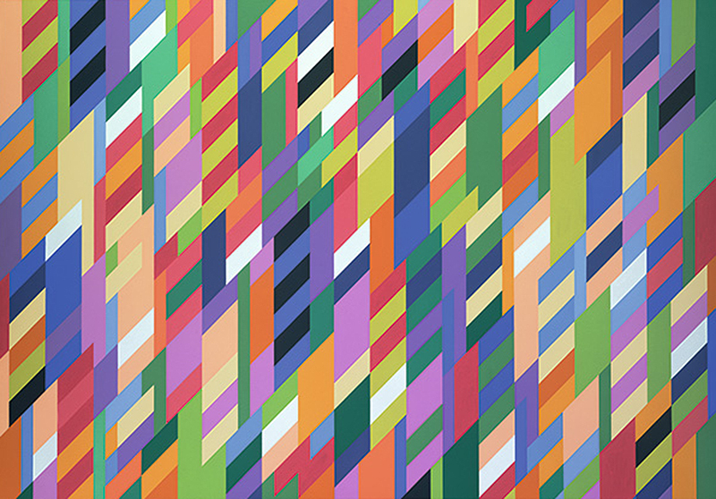

# Creative Coding in Processing: Day 1

## Agenda

* Welcome!
* What Is Creative Coding?
* Getting to Know Processing
* Hello World
* Formal Elements in Art and Code
* Reverse Engineering the Masters

## Welcome to Creative Coding I


* You are a beginner, adventurous, up for a challenge.
* You know coding is not "the future", it is **NOW**.
* You also know that understanding code isn't just for professional programmers and software developers. It's for everyone.
* You know that programming and software development are as an essential part of literacy in the modern era as reading and writing.
* You know it's not just about getting $#!7 done, but expressing who we are and what we experience.

**By the book:** *Creative Coding is an approach to programming that is oriented towards expression as opposed to functionality.*

## Who Am I


I'm [Phillip David Stearns](https://phillipstearns.com). I wear a lot of different hats. Mostly, I'm an artist.

I know a little bit about:

* Coding
* Electronics
* Physical Computing
* Hacking (hardware/software/security)
* Textile Design and Weaving
* 3D Animation and Rendering
* Welding
* Printmaking (2D, 3D, laser cutting/engraving/etching/bleaching)
* Photography
* Bread Making

## What is Creative Coding?


Creative Coding is a term that applies broadly to the use of code to solve problems traditionally dealt with in the creative disciplines of art and design.

The use of computers to create art can be traced back to the 1950s.

Since then, several different forms of art the use the computer in different ways have developed and been identified by practitioners and researchers:

### Computer Art


<br>Hal Lasko

Broadly, art made with computers and computer programs, including (yes, perhaps especially) MS Paint. Digital Art is almost synonymous with Computer Art, though the main distinction is that Computer Art is either created or generated within the computer, with little to no use of outside material (sounds, pictures, video).

### Algorithmic Art


Art made with computers, but specifically using algorithms.

An Algorist is someone who writes their own algorithm to create art with a computer. 

```
if (creation && object of art && algorithm && one's own algorithm) {
     return * an algorist *
} else {
     return * not an algorist *
}
// Jean-Pierre Hébert
```

### Generative Art


<br>Vera Molnár

Art made with autonomous systems. Predates computer art with early examples found in music. Computer generated art, specifically Algorithmic Art is a subset of generative art. Here the principles of creating artwork with an autonomous, generative system is fulfilled or aided by the use of computer algorithms.

### Physical Computing


<br>Sougwen Chung

The use of embedded computation to influence physical objects with code.

## Getting to Know Processing

If you haven't already, **Download** and **Install** Processing from [Processing.org](http://processing.org/download).

Open it up and this is what will greet you!


### IDE: Integrated Development Environment

An application that gives a developer a full suite of tools for development:

* Editor
* Debugger
* Build Automation

Processing specific:

* Examples
* Library Management

### Processing is Java

If you code in Processing, you are coding Java. Processing takes are of some of the complexities of writing software and provides artists with tools to quickly make programs that have interactive visual output.

Processing programs are called sketches.

## Hello World!

1. If you don't already have a blank sketch in front of you, create a new one, and save it as `HelloWorld`.

2. Type this text into your Processing IDE.


```
ellipse(50, 50, 25, 25);
print("Hello World!");
```

3. Press the **"Play"** button, or `command+r`

Congratulations! You wrote your first Processing program!

## Programming Basics: Flow and Structure


### Program Flow

* Code is executed one line at a time, one operation at a time.
* *Generally*, code is read top to bottom. There are cases when we jump from one part of our program to another, which we'll cover later.
* Operations follow a [specific order](https://introcs.cs.princeton.edu/java/11precedence/). This order of precedence handles not only things like "multiply before adding", but also when to assign the shiny new value to a variable. 


### Structure: Functions

Programs can contain hard coded data, like the text `"Hello World"` or the numbers in the `ellipse()` function. Data in Processing has a number of different types. For text `char` stores individual characters, and `String` stores strings of chars.

`ellipse()` and `print()` is a function. Functions are references to more complex blocks of code tucked away somewhere else. We can run these blocks of code by calling a function like we did in our `HelloWorld` sketch. Processing's built-in functions can be viewed only by looking at its code.

Functions like `ellipse()` will accept and in some cases require parameters or arguments to be provided in the `()`. In the case of the `ellipse()` function, it expects the x and y coordinates of the ellipse, in addition to the width and height.

`ellipse(x, y, width, height)`

### Structure: Essentials

Processing uses two functions to setup or initialize our sketch and to draw.

1. Open a new project and save it as `playground`.
2. Type the following text:

```
void setup(){
}

void draw(){
}
```

#### `void setup()`

* Runs once at the startup of our sketch
* Must specify `size()` of our canvas
* Can set things like `frameRate()`, `background()`, `noLoop()`
* Generally used to initialize variables

#### `void draw()`

* After `setup()` runs, `draw()` is executed once per frame.
* `draw()` is a loop that runs continuously
* can stop looping with `noLoop()`
* can resume looping with `loop()`

### Structure: Variables

Type the following and run it:

```
void setup(){
	size(500, 500);
}

void draw(){
	ellipse(width/2, height/2, 50, 50);
}
```

Notice that `width` and `height` are colored pink. Processing uses this color to indicate internal variables. These variables are where the values we put into the `size()` function are stored.

Next change it to look like:

```
float x;
float y;
float size;

void setup(){
	size(500, 500);
	x = width/2;
	y = height/2;
	size = 50;
}

void draw(){
	ellipse(x, y, size, size);
}
```
What we've just done is replaced the hard coded values with variables. Variables store data in a way that allows us to recall and manipulate that data, use it in other places and store it again.

### Structure: Data Types

In Processing, as with Java, variables hold data, and data has different types. Here are some basic data types:

Type		|	Data
:---:		|:---:
int			| integers<br>whole numbers
float		| floating point<br>decimal place
boolean	| true/false
color		| 32 bit color<br>ARGB or AHSV
char	 	| single character
String		| a string of text

## Color


Let's have a look at how we can work with color in Processing.

By default, Processing uses a 32bit value to store Aplha, Red, Green, Blue pixel data in 8 bits per channel.

Let's add to our code:

```
float x;
float y;
float size;

color fillColor = #1b7cd9;
color strokeColor = color(0);
color backgroundColor = color(201,225,255);

void setup(){

	size(500, 500);
	
	x = width/2;
	y = height/2;
	size = 50;
	
	background(backgroundColor);
	
}

void draw(){

	background(backgroundColor);
	
	stroke(strokeColor);
	fill(fillColor);
	
	ellipse(x, y, size, size);
}

```

## Style

You may have noticed that we've introduced a couple of new functions. Here are a few functions that are essential for styling the elements in our sketch:

function		|	description
:---				|:---
`background()`	| set the background color using a color datatype
`stroke()`		| set the stroke or line color using a color datatype
`strokeWeight()`	| set the stroke or line thickness using a float
`noStroke()`		| makes strokes or lines invisible
`fill()`			| set the fill color of an object using a color dataype
`noFill()`		| makes fill invisible

*Every time you call a style function, it applies to all subsequent objects!*

## Drawing Lines

Processing has a handful of built-in functions for drawing lines.

1. Let's save the code we've been working on with `command+s`
2. Now let's save as with `command+shift+s` and name this sketch `lines`
3. Modify the code to look like this:

```
float x1;
float y1;
float x2;
float y2;

float lineWeight = 0.5;

color strokeColor = #001b53;
color backgroundColor = color(201,225,255);

void setup(){

	size(500, 500);
	
	x1 = 0;
	y1 = 0;
	x2 = width;
	y2 = height;
	
	background(backgroundColor);
	
}

void draw(){

	background(backgroundColor);
	
	stroke(strokeColor);
	strokeWeight(lineWeight);
	
	line(x1, y1 ,x2 ,y2 );
	
}
```

## Multiple Lines

We're ready to start using our variables to store and manipulate. A simple application of this is to create movement.

Let's make some modifications to our code:

```
float x1;
float y1;
float x2;
float y2;

float x_step;

float lineWeight = 0.5;

color strokeColor = #001b53;
color backgroundColor = color(201,225,255);

void setup(){

	size(500, 500);
	
	x1 = -width;
	y1 = 0;
	x2 = 0;
	y2 = height;
	
	x_step = width/24;
	
	background(backgroundColor);
	
}

void draw(){

	x1 = x1 + x_step;
	x2 = x2 + x_step;
	
	stroke(strokeColor);
	strokeWeight(lineWeight);
	
	line(x1, y1 ,x2 ,y2 );
	
}
```

We changed the start position of the line to shift it off the screen to the left.

We then use the variable x\_step to shift it back to the right again. The x\_step was calculated by dividing the width by 24. Why 24? Because I had to choose something. It could have been 12. Try that.

By adding x_step to our x1 and x2 points, we change where the line will be drawn with each passing of the `draw()` loop.

Let's see what happens when we create and change the y_step too:

```
float x1;
float y1;
float x2;
float y2;

float x_step;
float y_step;

float lineWeight = 0.5;

color strokeColor = #001b53;
color backgroundColor = color(201, 225, 255);

void setup() {

  size(500, 500);

  x1 = 0;
  y1 = 0;
  x2 = 0;
  y2 = height;

  x_step = width/24;
  y_step = height/24;

  background(backgroundColor);
}

void draw() {

  x1 += x_step;
  x2 += x_step;
  y1 += y_step;
  y2 -= y_step;
  stroke(strokeColor);
  strokeWeight(lineWeight);

  line(x1, y1, x2, y2 );
}
```

Now we're getting dangerous!

## Formal Elements of Art in Processing Pt. 1

Processing was made with artists in mind, so let's have a look at how the built in functions give us the ability to create using basic formal elements of art.

* Point
* Line
* Shape
* Form

Then we'll take a few moments to play and draw different shapes

### Point


<br>Henri-Edmond Cross

* A single mark with a location and weight
* In multiples, can be powerful
* Density can suggest form, shape, tone, line, texture

function	|	description
:---					|:---
`point(x, y`			|	a single point

### Line


<br>Marius Watz

* A mark made by moving a point on a surface
* The quality of the line and its characteristics hold its expressiveness
* Can suggest shape, movement, contour

function	|	description
:---					|:---
`line(x1, y1, x2, y2)`					|	a straight line between two points
`curve(c1x, c1y, x1, y1, x2, y2, c2x, c2y)`				|	a curve described by four points:<br>1. Control Point for Beginning<br>2. Beginning<br>3. End<br>4. Control Point for End
`bezier(x1, y1, c1x, c1y, c2x, c2y, x2, y2)`				|	a curve described by four points:<br>1. Beginning<br>2. Control Point for Beginning<br>3.  Control Point for End<br>4. End

### Shape


<br>Sophie Taeuber-Arp

function	|	description
:---					|:---
`ellipse()`			|	ellipse or circle
`circle()`			|	circle
`arc()`				|	arc, or partial circle/ellipse
`rect()`				|	rectangle or square
`square()`			|	square
`tringle()` 			|	triangle
`quad()`				|	a four sided polygon

* can be a region enclosed by a line, consisting solely of the line
* can be a region of color or texture that is distinct
* can be suggested by other elements

---

## Let's Take a Moment to Play!

### 1. Draw one of each of these primitives

* `point()`
* `arc()`
* `ellipse()`
* `circle()`
* `square()`
* `rect()`
* `quad()`
* `line()`
* `curve()` or `bezier()`
* `triangle()`

### 2. Style each primitive uniquely

* `background()`
* `stroke()`
* `strokeWeight()`
* `noStroke()`
* `fill()`
* `noFill()`

### 3. Draw a face?

### 4. Save Your Work!

---

## Formal Elements of Art in Processing Pt. 1

### Form


<br>Charlotte Posenenske

Pertains to the shape of objects in three dimensions.

* Can be suggested by other elements
* Oftentimes a 3D model in computer generated art

function		|	description
:---						|:---
box()						| 3D Cuboid
sphere()					| 3D Spheroid

\*must be using the 3D rendering engine, e.g. `size(500, 500, P3D)`

### Tone


<br>Agnes Martin

Is the quality of light or darkness. This can simulate or give the impression of light quality through shading. Pay attention to how 2D animations use shadow and highlight to convey form.

### Texture


<br>Tauba Auerbach

The surface quality. This gives the impression of what something feels like. Since we're dealing with computer generated art, our texture is simulated. It's a visual texture.

In Processing we can use shapes and lines to create visual textures. We can also use images and different functions to control pixels individually.

Have a look at `loadPixels()` and `updatePixels()` along with the `pixels[]` array. We'll cover `PImages` in the next class.

### Repetition


<br>Bridget Riley


Repetition can occur at different scales to achieve a range of effects. Repetition is something that's intuitive and readily accessible to the creative coder. For loops are the basis of repetition.

### Pattern


By repeating a texture, shapes, lines, or tones and colors, one can create a pattern. The underlying order or design that guides the quality of a pattern is called a motif. When we deal with motifs and patterns, understanding how to define classes and instantiate objects described by those classes becomes essential.


### Composition

Analyzing a composition...


...is kinds of like analyzing stocks.


Jokes aside, composition is the result of these different elements coming together in a work of art. Generally, it's how an artwork utilizes space.

## Repetition: Loops and Arrays


### `draw()` is a loop

* by default, `draw()` is executed at 60 frames per second
* anything in `draw()` is repeated

### For loop

1. Create a new sketch (save your old one)
2. Run the following code

```
for ( int i = 0 ; i < 100; i++) {
  println(i);
}
```

#### For Loop Structure

The for loop looks kind of like a function:

* The code inside `()` sets the conditions for when the loop exits
	1. 	`int i = 0` initializes the integer, `i`, which is used as an index or counter
	2. `i < 100` is a conditional expression that evaluates to true or false. If true, the loop keeps going.
	3. `i++` is shorthand for `i = i + 1`. This increments the counter by one step
* The code inside the `{}` is executed once per loop and can contain other for loops!
* If we want to exit from a for loop, we can can use `return`.

#### Application of a For Loop

Let's say we wanted to draw a row of 5 squares to the canvas, equally spaced...

```
// we'll use variables instead of hard coding things

// spacing between squares
float squareSpacing;

// where to start drawing the row of squares
float rowX;
float rowY;

// the width of our squares
float squareWidth = 50;
// how many
float qty_squares = 25;

void setup() {
  
  size(500, 500);
  background(255);
  
  squareSpacing = width / (qty_squares + 1);
  rowX = squareSpacing;
  rowY = height / 2;
  
}

void draw() {
  
  background(255);
  
  // by default the rect and square dsraw from their upper right
  // drawing from center can help simplify things for us
  rectMode(CENTER);
  
  
  for (int i = 0; i < qty_squares; i++) {
    // each time the for loop executes, a square is drawn
    square(rowX + (i * squareSpacing), rowY, squareWidth);
  }
  
}
```