# Creative Coding in Processing: Day 2

## Agenda

* Review
* Creative Coding Challenge

## Review

### Functions

Abstractions of lower level code that allow us to do complex things by writing only a few lines of code.

* Processing has many built-in functions to allow us to create visual works quickly.
* `setup()` and `draw()` are the fundamental functions used by Processing sketches

### Shapes, Color, Style

Processing functions give us the ability to quickly and easily create a plethora of shapes and to style them.

* 2D primitives generally require coordinates for points or centers or coners
* `rectMode()` and `ellipseMode()` can change how coordinate are interpreted to draw `rect()`, `square()`,`ellipse()`, and `circle()`.

Color can be specified in a number of different ways:

```
color fillColor = #1b7cd9;
color strokeColor = color(0);
color backgroundColor = color(201,225,255);
color hexColor = 0xffdb89f3;
```

Style can be set in a number of ways:

```
noStroke();
stroke();
strokeWeight();
noFill();
fill(); // sets the text color
background();
textAlign();
textSize();
```

* styles are set before drawing a shape
* styles apply to all subsequent shapes until new styles are set

### Variables

Nifty little things that allow us to store data.

* Variables are **declared** by specifying **data type** and giving it a name.
* Variables are **initialized** by assigning data to them.
* Variables of different types may interact with each other in unpredictable ways


### For Loops

When we want to do something multiple times, like draw a circle, and you don't want to write `circle()` for each time you want one to appear.

```
// draw 100 circles to the screen
int qty_circles = 100;
for(int i = 0 ; i < qty_circles; i++){
	circle(random(width), random(height), random(5,50));
}
```

* can be nested for multi-dimensional situations
* needs: a counter of type `int`, a conditional expression for exiting, to increment or decrement the counter

### Arrays

Allow us to store multiple values in a single structure.

* arrays contain a number of elements
* the number of elements must be specified and is fixed
* `int[] wholeNumbers = new int[5]`
* `int[] wholeNumbers = { 25, 34, 73, 99, 1 };`
* array elements are accessed by specifying the index for the element: `wholeNumbers[0]`
* data is assigned to an element by specifying the index as well: `wholeNumbers[0]=32`


## Creative Challenge

We're ready to challenge ourselves! Let's see how far we can get with our under standing of Processing after only one day!

1. Find a work of art that was created without the use of computers.
2. Do a basic formal analysis of its elements.
3. Translate the elements into Processing functions and procedures.
4. Attempt to recreate that artwork or style.

### Easy Challenge: Sol Lewitt

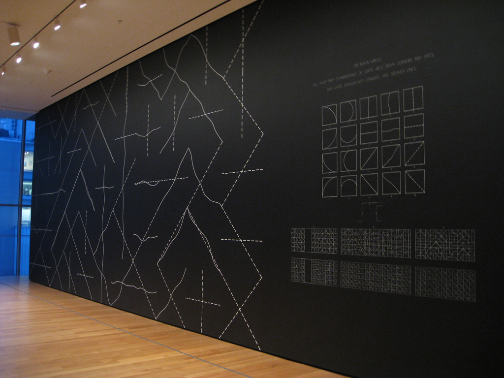

### Fun Challenge: Bridget Riley

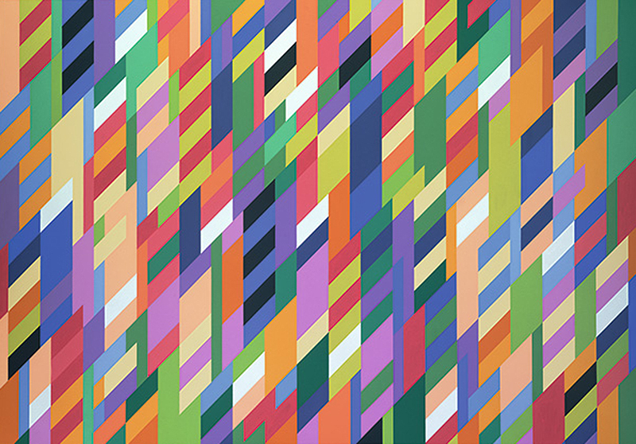

### Ultimate Challenge: Wassily Kandinsky

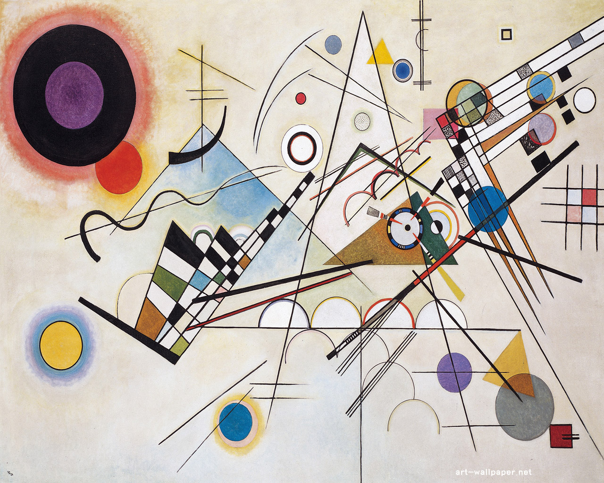

## Recreating Bridget Riley

### 1. Large Scale Analysis

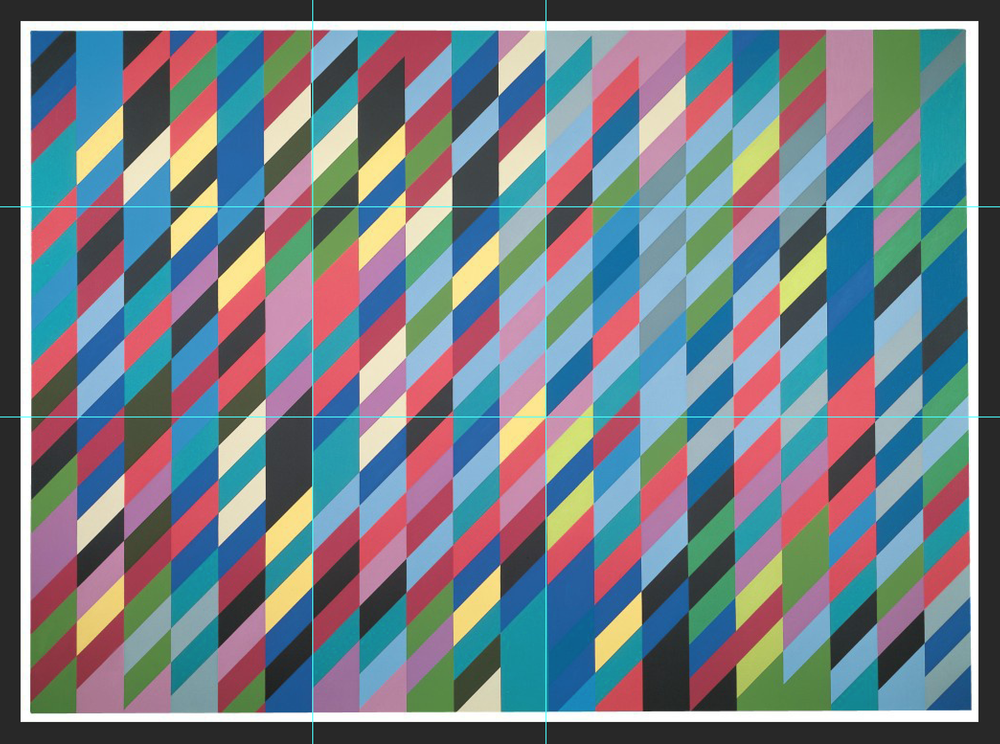

* The composition of *"Cool Place"* by Bridget Riley consists of many smaller tiled parallelograms of the same size, arranged into columns.

* The parallelograms are aligned with their neighbors in such a way that straight diagonal lines can be traced along their top and bottom edges, forming a skewed grid.

### 2. Detail Analysis

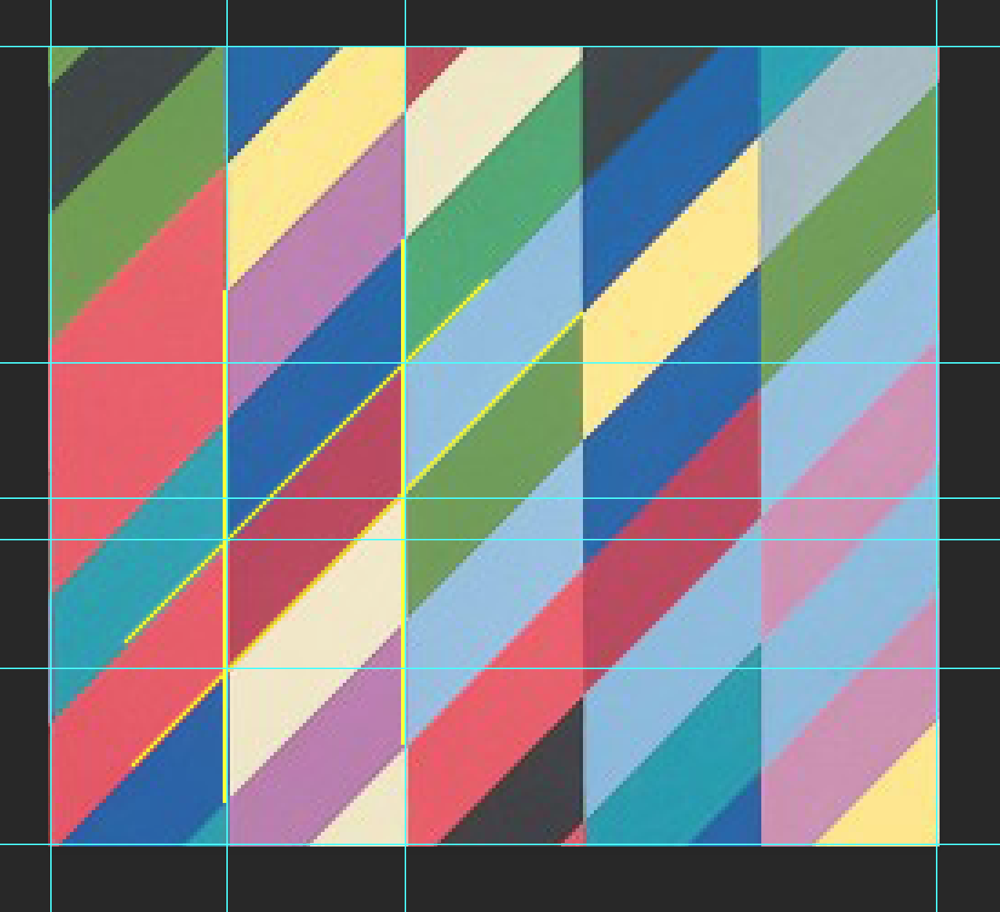

* On each parallelogram, one pair of sides is vertical, and the other are a diagonal sweeping up and to the right.

* The parallelograms can be though of as rectangles with the right side shifted upwards.

* The amount of skew produces an approximate angle 45 degrees.

* The `quad()` function seems like a good place to start.

### 3. Drawing a Parallelogram with `quad`

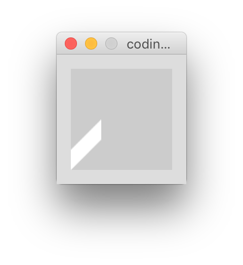

* The first step is the draw the fundamental element: a parallelogram.

* We do so in such a way that it's easy to make adjustments to the shape on the fly, by using variables and storing our points in arrays.

* We don't even need the `setup()` and `draw()` functions at this point.

```
// holds the coordinates of the points forming the quad
float[] x = new float[4]; 
float[] y = new float[4];

// the coordinates of the first point 
float quadOriginX=0; 
float quadOriginY=height;

// dimensions of the quad
float quadSideHeight=20;
float quadWidth=30;
float quadSkew=30;

// calculating the points
x[0]=quadOriginX;
y[0]=quadOriginY;
x[1]=x[0];
y[1]=y[0]-quadSideHeight;
x[2]=quadOriginX+quadWidth;
y[2]=quadOriginY-(quadSideHeight+quadSkew);
x[3]=x[2];
y[3]=y[2]+quadSideHeight;

// turn off the stroke
noStroke();

// draw it!
quad(x[0],y[0],x[1],y[1],x[2],y[2],x[3],y[3]);
```
### 4. Encapsulating the Parallelogram into a Custom Function

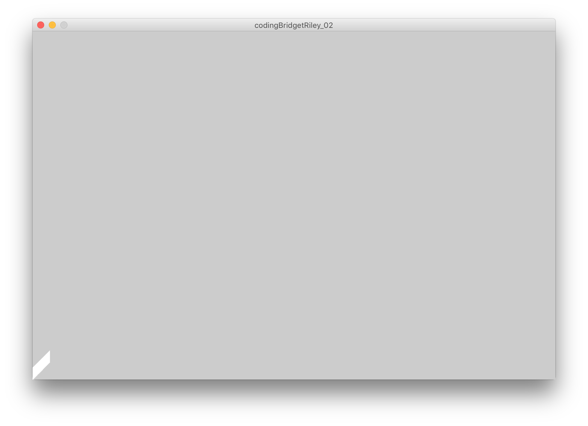

If we're going to be drawing literally hundreds of shapes to the screen, we need a way to keep our code compact and readable.

```
// the x and y coordinates of our 4 points
float[] x = new float[4];
float[] y = new float[4];

// dimensions of the quad
float quadSideHeight=20;
float quadWidth=30;
float quadSkew=30;

void setup() {
  size(900, 600);
}

void draw() {
  // use a custom function to draw the parallelogram
  drawParallelogram(0, height);
}

// previous example's parallelogram code encapsulated
void drawParallelogram(float _x, float _y) {

  // a function that performs the calculations of the points
  calculatePoints(_x, _y);

  noStroke();
  quad(x[0], y[0], x[1], y[1], x[2], y[2], x[3], y[3]);
}

// fills the coordinate arrays based on given origin coordinates 
void calculatePoints(float _x, float _y) {
  x[0]=_x;
  y[0]=_y;
  x[1]=x[0];
  y[1]=y[0]-quadSideHeight;
  x[2]=_x+quadWidth;
  y[2]=_y-(quadSideHeight+quadSkew);
  x[3]=x[2];
  y[3]=y[2]+quadSideHeight;
}
```
### 5. Using a For Loop to the Make Columns

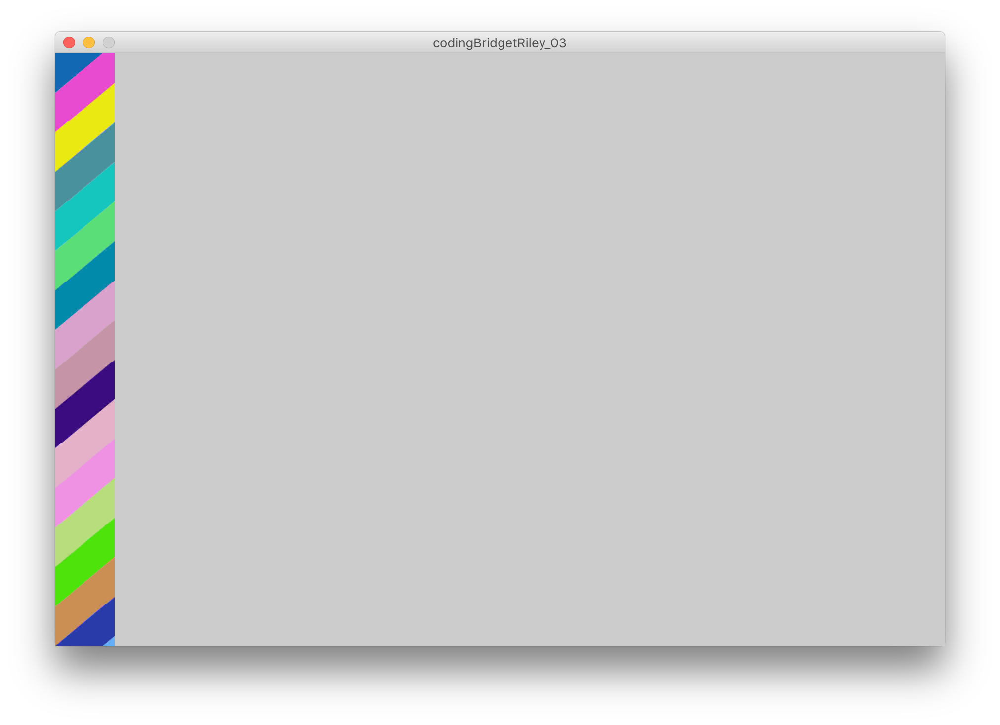

```
// the x and y coordinates of our 4 points
float[] x = new float[4];
float[] y = new float[4];

// dimensions of the quad
float quadSideHeight=40;
float quadWidth=60;
float quadSkew=50;

void setup() {
  size(900, 600);
  noLoop();
}

void draw() {
  
  // calculate how many parallelograms to draw vertically
  int qty_rows = int(height/(quadSideHeight))+4;
  
  // draw a column of parllelograms!
  for (int y = 0; y < qty_rows; y++) {
    
    color fillColor = color(random(256), random(256), random(256));
    fill(fillColor);
    
    drawParallelogram(0, y*quadSideHeight);
    
  }
  
}

void drawParallelogram(float _x, float _y) {

  // a function that performs the calculations of the points
  calculatePoints(_x, _y);

  noStroke();
  quad(x[0], y[0], x[1], y[1], x[2], y[2], x[3], y[3]);
  
}

void calculatePoints(float _x, float _y) {
  
  // 1st point, the origin
  x[0]=_x;
  y[0]=_y;
  
  // 2nd point, move up from the origin
  x[1]=x[0];
  y[1]=y[0]-quadSideHeight;
  
  // 3rd point, move right and then up
  x[2]=_x+quadWidth;
  y[2]=_y-(quadSideHeight+quadSkew);
  
  // 4th point, move down to finish the shape
  x[3]=x[2];
  y[3]=y[2]+quadSideHeight;
  
}
```
### 6. Draw Columns Across the Canvas

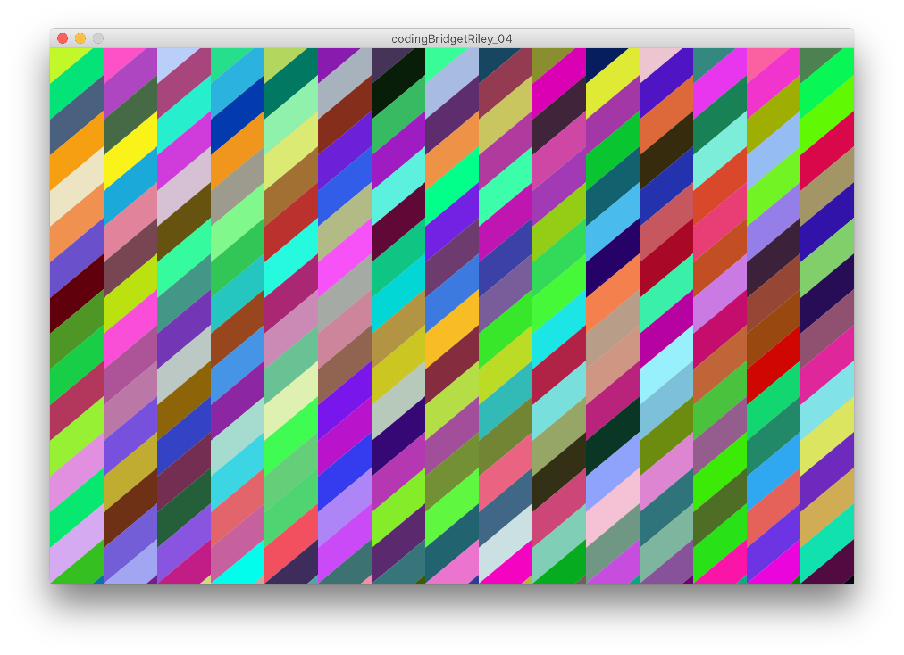

The major change was creating a nested for loop that draws parallelograms across and down the screen.

Checkout the addition to our `draw()` function.

```
void draw() {

  // calculate how many parallelograms to draw vertically
  int qty_rows = int(height/(quadSideHeight))+4;
  // calculate how many parallelograms to draw horizontally
  int qty_cols = int(height/(quadSideHeight))+4;
  
  // draw the "grid" of parallelograms!
  for (int y = 0; y < qty_rows; y++) {
    
    for (int x = 0; x < qty_cols; x++) {
      
      color fillColor = color(random(256), random(256), random(256));
      fill(fillColor);
      
      drawParallelogram(x*quadWidth, y*quadSideHeight);
      
    }
    
  }
  
}
```
### 7. Align the Parallelograms

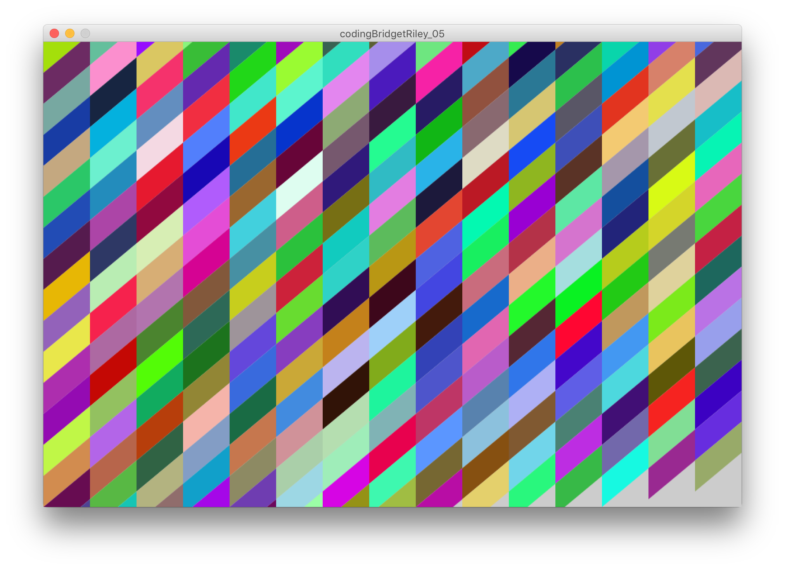

In order to align the parallelograms, we need to shift each column a tiny amount.

I've also encapsulated the point coordinates inside the `drawParallelogram()` function.

Note that we can pass whole arrays into functions and when we perform operations on them, the changes are applied.

```
// the parallelogram dimensions
float quadSideHeight=40;
float quadWidth=60;
float quadSkew=50;

void setup() {
  
  size(900, 600);
  noLoop();
  
}

void draw() {
  
  // calculate how many "rows" and "columns" of parallelograms to draw
  int qty_cols = int(width/quadWidth)+1;
  int qty_rows = int(height/(quadSideHeight))+4;
  
  for (int y = 0; y < qty_rows; y++) {
    
    for (int x = 0; x < qty_cols; x++) {
      
      color fillColor = color(random(256), random(256), random(256));
      fill(fillColor);
      
      drawParallelogram(x*quadWidth, y*quadSideHeight-((quadSkew-quadSideHeight)*x));
      
    }
    
  }
  
}

void drawParallelogram(float _x, float _y) {

  // we moved this from the global scope just to clean things up
  float[] pts_x = new float[4];
  float[] pts_y = new float[4];

  // a function that performs the calculations of the points
  // we can actually pass the arrays for the points to it!
  calculatePoints(_x, _y, pts_x, pts_y);

  noStroke();
  quad(pts_x[0], pts_y[0], pts_x[1], pts_y[1], pts_x[2], pts_y[2], pts_x[3], pts_y[3]);
  
}

void calculatePoints(float _x, float _y, float[] _pts_x, float[] _pts_y) {
  
  // 1st point, the origin
  _pts_x[0]=_x;
  _pts_y[0]=_y; 
  // 2nd point, move up from the origin
  _pts_x[1]=_pts_x[0];
  _pts_y[1]=_pts_y[0]-quadSideHeight;
  // 3rd point, move right and then up
  _pts_x[2]=_x+quadWidth;
  _pts_y[2]=_y-(quadSideHeight+quadSkew);
  // 4th point, move down to finish the shape
  _pts_x[3]=_pts_x[2];
  _pts_y[3]=_pts_y[2]+quadSideHeight;
  
}
```

### 8. Extract the Color Palette

There are several different techniques for doing this. When dealing with a small set of colors, it's possible to use the digital color meter to grab the RGB values off the screen.

* `command + spacebar` will open a spotlight search bar.
* Type "digital color" and open the Digital Color Meter tool

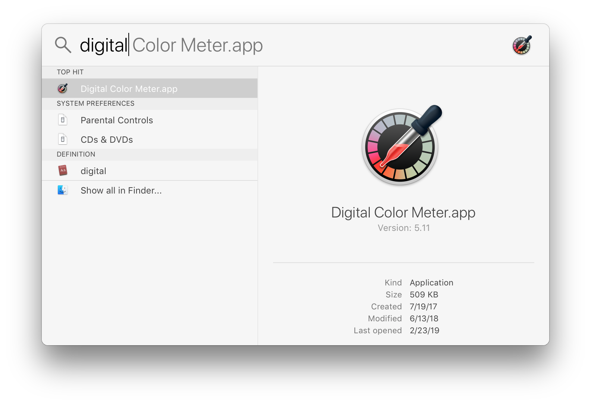

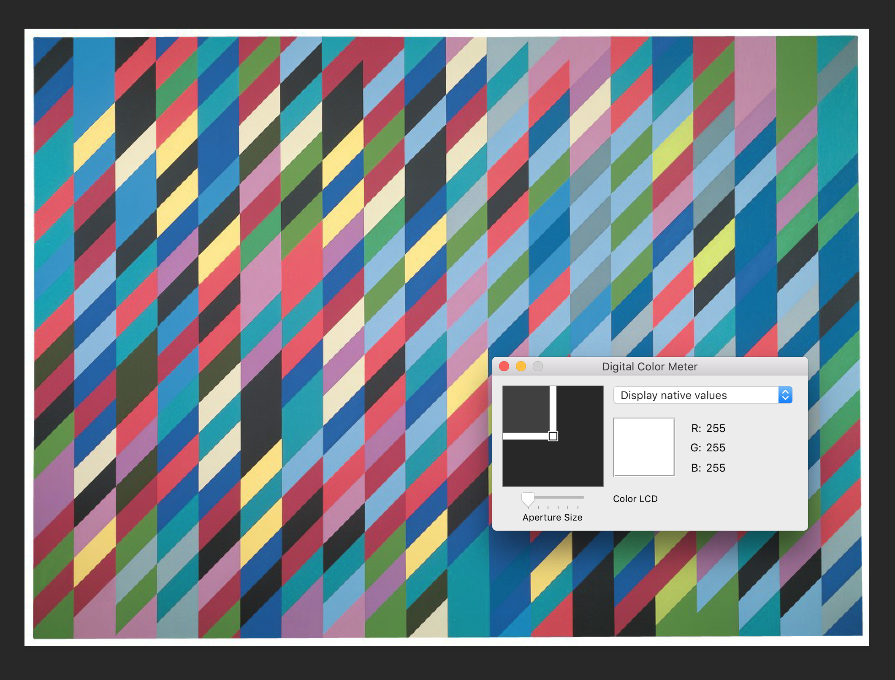

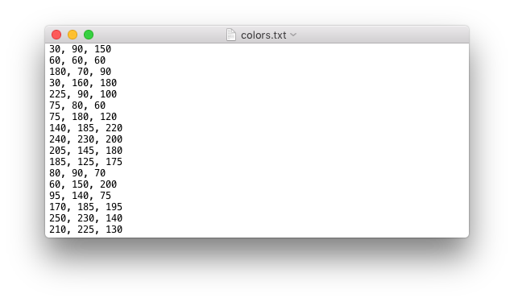

* Write down the RGB values and used them in your sketch:

```
//colors held in an array
color[] palette = {
  color(30, 90, 150), 
  color(60, 60, 60), 
  color(180, 70, 90), 
  color(30, 160, 180), 
  color(225, 90, 100), 
  color(75, 80, 60), 
  color(75, 180, 120), 
  color(140, 185, 220), 
  color(240, 230, 200), 
  color(205, 145, 180), 
  color(185, 125, 175), 
  color(80, 90, 70), 
  color(60, 150, 200), 
  color(95, 140, 75), 
  color(170, 185, 195),
  color(250, 230, 140), 
  color(210, 225, 130)
};

// dimensions of the parallelogram
float quadSideHeight=40;
float quadWidth=60;
float quadSkew=50;

void setup() {

  size(640, 480);
  noLoop();
}

void draw() {

  // calculate how many "rows" and "columns" of parallelograms to draw
  int qty_cols = int(width/quadWidth)+1;
  int qty_rows = int(height/(quadSideHeight))+4;

  for (int y = 0; y < qty_rows; y++) {

    for (int x = 0; x < qty_cols; x++) {

      // randomly choose a color from the palette
      fill(palette[int(random(palette.length))]);

      drawParallelogram(x*quadWidth, y*quadSideHeight-((quadSkew-quadSideHeight)*x));
    }
  }
}

void drawParallelogram(float _x, float _y) {

  // we moved this from the global scope just to clean things up
  float[] pts_x = new float[4];
  float[] pts_y = new float[4];

  // a function that performs the calculations of the points
  // we can actually pass the arrays for the points to it!
  calculatePoints(_x, _y, pts_x, pts_y);

  noStroke();
  quad(pts_x[0], pts_y[0], pts_x[1], pts_y[1], pts_x[2], pts_y[2], pts_x[3], pts_y[3]);
}

void calculatePoints(float _x, float _y, float[] _pts_x, float[] _pts_y) {

  // 1st point, the origin
  _pts_x[0]=_x;
  _pts_y[0]=_y; 
  // 2nd point, move up from the origin
  _pts_x[1]=_pts_x[0];
  _pts_y[1]=_pts_y[0]-quadSideHeight;
  // 3rd point, move right and then up
  _pts_x[2]=_x+quadWidth;
  _pts_y[2]=_y-(quadSideHeight+quadSkew);
  // 4th point, move down to finish the shape
  _pts_x[3]=_pts_x[2];
  _pts_y[3]=_pts_y[2]+quadSideHeight;
}
```
### Done!

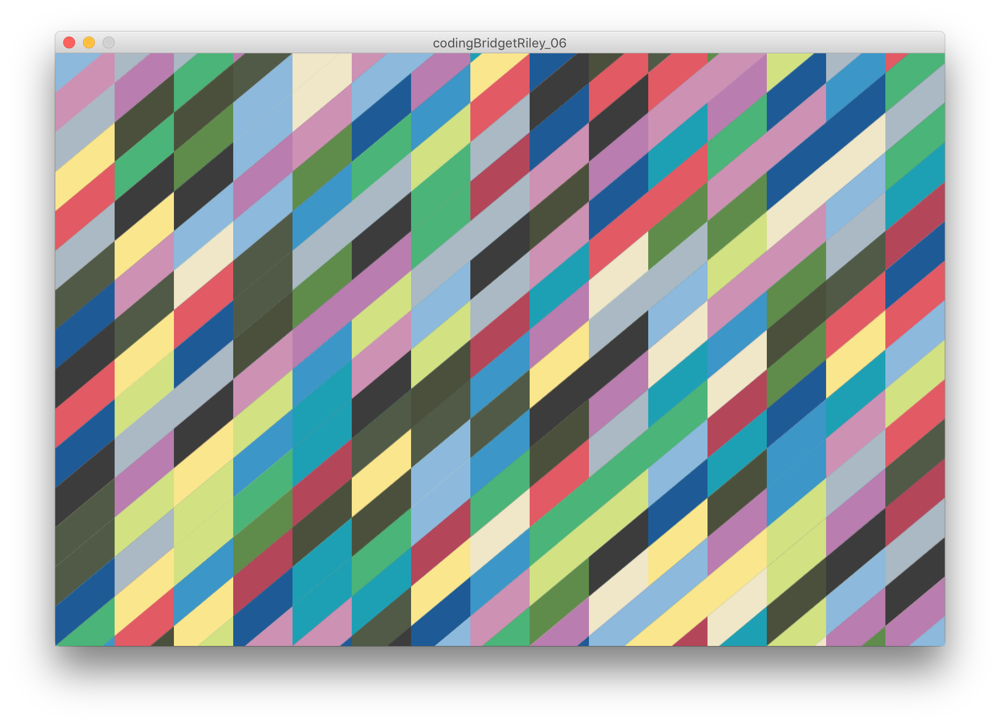


