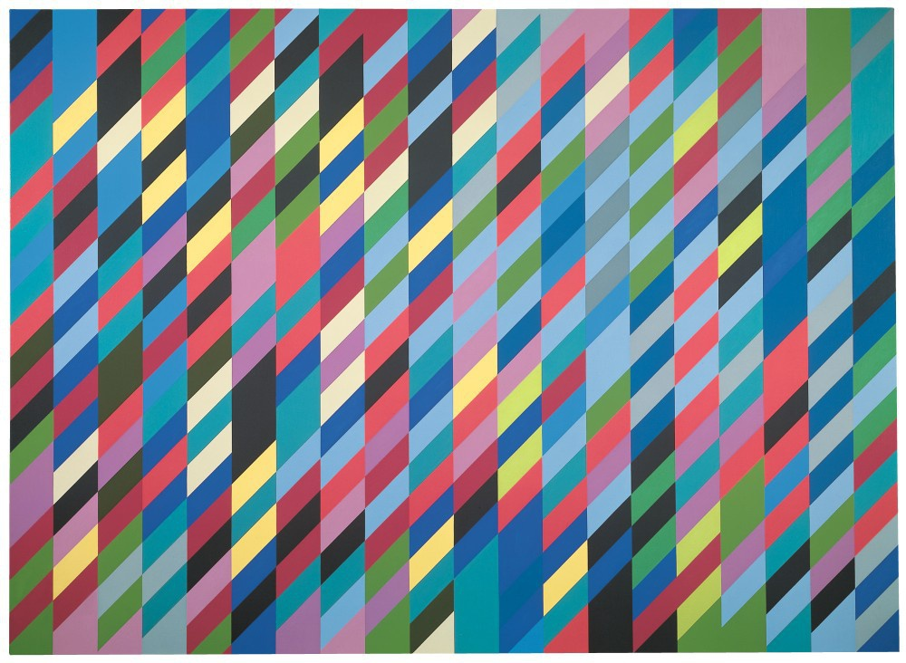

# Creative Coding in Processing: Day 2

## Agenda

* Review
* Creative Coding Challenge

## Review

### Functions

Abstractions of lower level code that allow us to do complex things by writing only a few lines of code.

* Processing has many built-in functions to allow us to create visual works quickly.
* `setup()` and `draw()` are the fundamental functions used by Processing sketches

### Shapes, Color, Style

Processing functions give us the ability to quickly and easily create a plethora of shapes and to style them.

* 2D primitives generally require coordinates for points or centers or coners
* `rectMode()` and `ellipseMode()` can change how coordinate are interpreted to draw `rect()`, `square()`,`ellipse()`, and `circle()`.

Color can be specified in a number of different ways:

```
color fillColor = #1b7cd9;
color strokeColor = color(0);
color backgroundColor = color(201,225,255);
color hexColor = 0xffdb89f3;
```

Style can be set in a number of ways:

```
noStroke();
stroke();
strokeWeight();
noFill();
fill(); // sets the text color
background();
textAlign();
textSize();
```

* styles are set before drawing a shape
* styles apply to all subsequent shapes until new styles are set

### Variables

Nifty little things that allow us to store data.

* Variables are **declared** by specifying **data type** and giving it a name.
* Variables are **initialized** by assigning data to them.
* Variables of different types may interact with each other in unpredictable ways


### For Loops

When we want to do something multiple times, like draw a circle, and you don't want to write `circle()` for each time you want one to appear.

```
// draw 100 circles to the screen
int qty_circles = 100;
for(int i = 0 ; i < qty_circles; i++){
	circle(random(width), random(height), random(5,50));
}
```

* can be nested for multi-dimensional situations
* needs: a counter of type `int`, a conditional expression for exiting, to increment or decrement the counter

### Arrays

Allow us to store multiple values in a single structure.

* arrays contain a number of elements
* the number of elements must be specified and is fixed
* `int[] wholeNumbers = new int[5]`
* `int[] wholeNumbers = { 25, 34, 73, 99, 1 };`
* array elements are accessed by specifying the index for the element: `wholeNumbers[0]`
* data is assigned to an element by specifying the index as well: `wholeNumbers[0]=32`


## Creative Challenge

We're ready to challenge ourselves! Let's see how far we can get with our under standing of Processing after only one day!

1. Find a work of art that was created without the use of computers.
2. Do a basic formal analysis of its elements.
3. Translate the elements into Processing functions and procedures.
4. Attempt to recreate that artwork or style.

### Easy Challenge: Sol Lewitt


### Fun Challenge: Bridget Riley



### Ultimate Challenge: Wassily Kandinsky


## Recreating Bridget Riley
