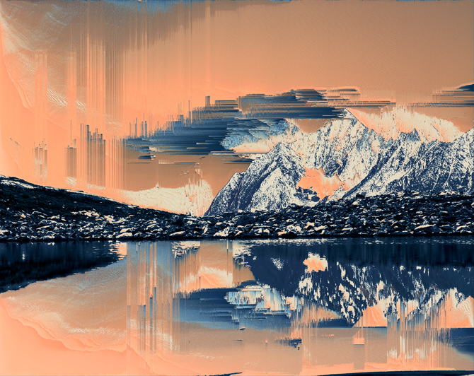
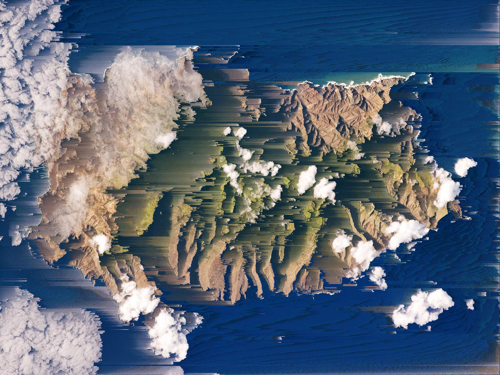
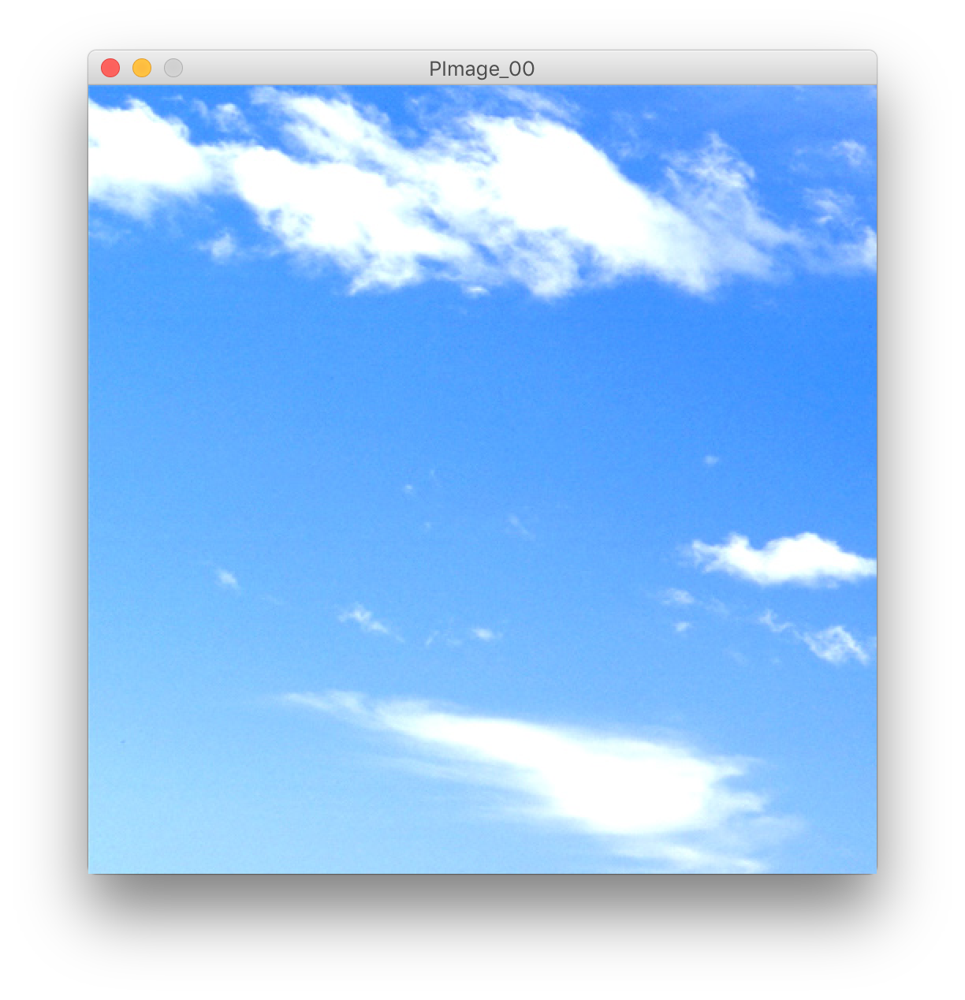
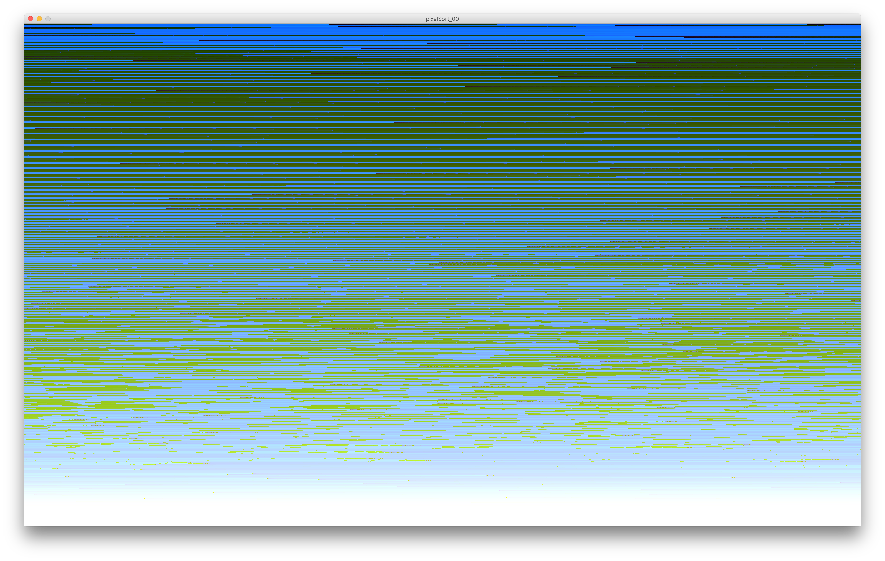

# Creative Coding II

Welome!

This workshop goes beyond the basics, by applying some common coding topics and processes to manipulating image data in unconventional ways.

## Pixelsorting

### A Brief History?

When you trawl through the internet using Google tinted magnifying glasses, one name dominates the emergence of the term Pixel Sorting on the Internet: Kim Asendorf. 

In 2005, a post in [MATLAB central](https://www.mathworks.com/matlabcentral/fileexchange/7379-image-pixel-sorting) appears with the title "Image Pixel Sorting". It's not clear whether this does anything close to what we know today as pixel sorting. But it's the earliest mention that a.) has anything to do with image processing, and b.) doesn't involved Kim.

In 2009, Kim Asendorf posted an image created by sorting the pixels of an entire image with the title: [Sorted Pixels: Processing Experiment](http://kimasendorf.tumblr.com/post/201238295/sorted-pixels-processing-experiment)

In 2010, a post in the [DreamInCode.net Forum](https://www.dreamincode.net/forums/topic	/152391-sorting-array-of-pixels/), contains code for a pixel sorting algorithm in progress. The task isn't image processing, but statistical analysis. Not for art, for analysis. No mention of Kim, but...



Later in 2010, Kim Asendorf publishes his iconic [Mountain Tour](http://cargocollective.com/kimasendorf/Mountain-Tour) series.

In the following year, mentions of pixel sorting appear in the Processing forums and the effect quickly becomes a mainstay of the wider glitch art community.



In 2012 on October 5th, Kim Asendorf published his source code for [ASDFPixelSort](https://github.com/kimasendorf/ASDFPixelSort) on github along with a companion post on [tumblr](http://kimasendorf.tumblr.com/post/32936480093/processing-source-code).

In 2013 Jeff Thompson began working on his own extended studies of pixel sorting, published on his [GitHub](https://github.com/jeffThompson/PixelSorting) account.

Glitche

### So What is it?

The idea behind pixel sorting is that pixels are just numbers and just like any array for numbers, it can be sorted.

The result of sorting an array of strings is predictable, the contents will be arranged in alphabetical order. When sorting numbers, the order will be from least to greatest. When working with pixel values, some unpredictable things happen. To understand why let's review how Processing handles color.

## Color In Processing


By default, Processing uses a 32bit value to store Alpha, Red, Green, Blue pixel data in 8 bits per channel.

This code demonstrates 4 different ways of working with color in Processing.


```
// greyscale
color c1 = color(0);

// RGB/HSB
color c2 = color( 201, 225, 255 );

// 24bit RGB Hex
color c3 = #1b7cd9;

// 32bit ARGB
color c4 = 0xffb451a9;

// put the colors in an array
color[] colors = { c1, c2, c3, c4 };


void setup() {

  size( 500, 500 );
  background(255);
}

void draw() {

  background(255);

  // increment the colors in different ways
  updateColors();

  for ( int i = 0; i < colors.length; i++) {
    fill(colors[i]);
    circle( ( i + 1 ) * width / ( colors.length + 1 ), height/2, 50);
  }
}

void updateColors() {

  // incrementing a greyscale value
  colors[0] = color( frameCount % 255);

  // extracting RGB values and incrementing one, then repacking with color()
  colors[1] = color( (red( colors[1] ) + 1) % 255, green( colors[1] ), blue( colors[1] ) );

  // simply increment the number
  colors[2]++;

  // using bitwise operators to mask, 
  colors[3] = colors[3] & 0x00FFFFFF | (((colors[3] >> 24) + 1 ) % 255) << 24;
}
```

We'll be working with images, so it's time to have a look at Processing's PImage class.

## PImage and Classes

PImage is a class within Processing that holds information about the width and height of the image as well as the pixel data. There are also a few methods that allow us to do some tasks related to image processing, but before we dig into the PImage class, let's go deeper into just what a class is and how it related to objects.

### Classes

In Java, as with other Object Oriented Programming languages, classes describe objects that share a common set of properties and behaviors.

* Properties are called **fields** and are *variables* that contain data specific to an object.
* Behaviors are called **methods** and are *functions* that perform tasks specific to an object.
* Objects are **defined**  or described by classes.
* Objects are **instantiated** similar to declaring a variable.
* Objects must be initialized using **constructors**, special functions that determine the initial value of fields.

```
// definition of a class

class Object{

	// fields
	float field;
	
	// constructor
	Object(){
	}
	
	// methods
	void method();
	
}

// creating an instance of an object of class Object named object

Object object;

// initializing the instance of class Object named object

object = new Object();

// accessing fields

float someVar = object.field;
object.field = someVar;

// calling methods

object.method();
```

### PImage

The PImage class defines image objects. Its fields are:

* `int width`
* `int height`
* `color[] pixels`

Its the methods are:

* `loadPixels()` - Loads the pixel data for the image into its `pixels[]` array
* `updatePixels()` - Updates the image with the data in its `pixels[]` array
* `resize()` - Changes the size of an image to a new width and height
* `get()` - Reads the color of any pixel or grabs a rectangle of pixels
* `set()` - writes a color to any pixel or writes an image into another
* `mask()` - Masks part of an image with another image as an alpha channel
* `filter()` - Converts the image to grayscale or black and white
* `copy()` - Copies the entire image
* `blend()` - Copies a pixel or rectangle of pixels using different blending modes
* `save()` - Saves the image to a TIFF, TARGA, PNG, or JPEG file

Full reference for the PImage class can be found [here](https://processing.org/reference/PImage.html).

## Loading and Displaying (example PImage_00)



Instead of using the syntax `Pimage myImage = new PImage();`, we initialize PImage objects using `createImage()` or `loadImage()`.

1. Start a new Processing sketch. Save it and go to its containing folder.
2. Create a new folder called '"images".
3. Hop online and pick an image, any image. Could be a dog or a cat, mountains if you want to make an homage to Kim Asendorf; a nebula, anything so long as you save it in the image folder.
4. Next, copy the code below and modify it to display your image:

```
// create a PImage instance and name the object "img"
PImage img;

void setup(){
  
  // initialize our canvas dimensions
  size(500, 500);
  
  // use loadImage() to load an image into img
  img = loadImage("images/windows_xp_bliss-wide.jpg");
  
  // we only need to draw once
  noLoop();
  
}

void draw(){
  
  // draw our image, img, to the canvas, at the given x, y coordinates
  image(img, 0, 0);
  
}
```
### Awesome! But my image doesn't fit in the window...

## Resizing


Well you have a couple of options. You can stretch your image so that it fills the window, scale it to fill, scale it to fit, or you can resize the window to fit the image.

### Scaling the image

There are actually a couple of different options here.

1. Change the size of the image using `resize()` method.
2. Change the `imageMode()` to specify the location of the upper left and lower right corners.

Let's focus on the `resize()` methods.

#### Stretch to Fill 

For the first option add `img.resize(width, height);` above the line where we call `image()`.

#### Scale to Fill (example PImage_01)

If you want to maintain aspect ratio using a "scale to fill" method, you have to do a bit more math. Try to solve this challenge on your own.

#### Scale to Fit (example PImage_02)

If you want to maintain aspect ratio using a "scale to filt" method, the math is almost exactly the same except one operator is "flipped". Can you guess which one?

### Resizing the window (example PImage_03)

We're familiar with setting the `size()` of the the canvas window in the `setup()` function, but what if you wanted to resize the window to fit an image you're working on?

You can make sketch windows resizable using the following code in your `setup()`:

```
void setup() {
  size(500, 500);  // size always goes first!
  surface.setResizable(true);
}
```

Here's a note from the Processing GitHub repo about changing window size:

>You can also change the size of the window using the method surface.setSize(w, h). The size change is not instantaneous — it cannot resize the display while in the middle of drawing to it. If you call setSize() inside setup(), the first point at which you'll have the correct size is when draw() runs.

```
// create a PImage instance and name the object "img"
PImage img;

void setup() {

  // initialize our canvas dimensions
  size(100, 100);
  
  surface.setResizable(true);
  
  // use loadImage() to load an image into img
  img = loadImage("images/windows_xp_bliss-wide.jpg");
  
  // set the window size to the dimensions of our image
  surface.setSize(img.width, img.height);
  
  // we only need to draw once
  noLoop();
}

void draw() {
    image(img, 0, 0);
}
```
Easy!

## The pixels[] array

The `pixels[]` array allows us to access the image data at the pixel level. It's a linear, 1-dimensional array, so there are some tricks to use when iterating through. More on that later.

Something we need to do when altering the `pixels[]` array, is call the `loadPixels()` method on the PImage object before performing operations that alter the pixel data and `updatePixels()` once we're done performing pixel altering operations.

For instance, when we perform any operation that would sort our pixels, let's day for example, a function we make called `sortPixels()`, we'd need to do something like this:

```
img.loadPixels();
sortPixels(img);
img.updatePixels();
```
### Iterating through

If we want to get the color value at a specific location in our PImage, we can use the `get()` method, but there's a caveat:

>Getting the color of a single pixel with get(x, y) is easy, but not as fast as grabbing the data directly from pixels[]. The equivalent statement to get(x, y) using pixels[] is pixels[y*width+x]. See the reference for pixels[] for more information. 

`pixels[ y * width + x ]`

This little snippet of code holds the key for iterating through a 1-dimensional array that represents a two dimensional structure. The speed gains using this vs `get()` start to become important when we're dealing with millions of pixels.

Here's an example of how one might iterate through the rows of an image using the key above.

```
color[] row = new color[img.width];

img.loadPixels();
for (int y = 0; y < img.height; y++) {

  for (int x = 0; x < img.width; x++) {
    row[x] = img.pixels[ y * width + x ];
  }

  row = sort(row);

  for (int x = 0; x < img.width; x++) {
    img.pixels[ y * width + x ]= row[x];
  }
}
```

Woah... hold up! We're already sorting?

## OK... Sorting! (example pixelSort_00)

We're probably over prepared for this, but at least you're in a better position to understand exactly what's going on with the PImage code. Without going too deep into the plethora of sorting algorithms, let's setup our first pixel sorting sketch.

The easiest approach would be to just sort the whole pixels[] array:

1. Save any work you've been doing with `command+s`, but don't close the window!
2. "Save As" a new sketch
3. Alter the code below to suit your needs:

```
PImage img;

void setup() {
  size(100, 100);
  surface.setResizable(true);
  img = loadImage("images/windows_xp_bliss-wide.jpg");
  surface.setSize(img.width, img.height);
  noLoop();
}

void draw() {
  sortPixels(img);
  image(img, 0, 0);
}

void sortPixels(PImage _image) {
  _image.loadPixels();
  _image.pixels=sort(_image.pixels);
  _image.updatePixels();
}

```
You should get something like this:



## Sorting on Row by Row (example pixelSort_01)


```
PImage img;

void setup() {
  size(100, 100);
  surface.setResizable(true);
  img = loadImage("images/windows_xp_bliss-wide.jpg");
  surface.setSize(img.width, img.height);
  noLoop();
}

void draw() {
  sortRows(img);
  image(img, 0, 0);
}

void sortRows(PImage _image) {

  color[] row = new color[img.width];

  _image.loadPixels();

  for (int y = 0; y < img.height; y++) {
    for (int x = 0; x < img.width; x++) {
      row[x] = img.pixels[ y * width + x ];
    }

    row = sort(row);

    for (int x = 0; x < img.width; x++) {
      img.pixels[ y * width + x ]= row[x];
    }
  }
  _image.updatePixels();
}
```

## Sorting on Column by Column (example pixelSort_02)


```
PImage img;

void setup() {
  size(100, 100);
  surface.setResizable(true);
  img = loadImage("images/windows_xp_bliss-wide.jpg");
  surface.setSize(img.width, img.height);
  noLoop();
}

void draw() {
  sortCols(img);
  image(img, 0, 0);
}

void sortCols(PImage _image) {

  color[] col = new color[img.height];

  _image.loadPixels();

  for (int x = 0; x < img.width; x++) {
    for (int y = 0; y < img.height; y++) {
      col[y] = img.pixels[ y * width + x ];
    }

    col = sort(col);
    col = reverse(col);
    
    for (int y = 0; y < img.height; y++) {
      img.pixels[ y * width + x ]= col[y];
    }
  }
  _image.updatePixels();
}

```

## Moar Granulatrity PLZ!

